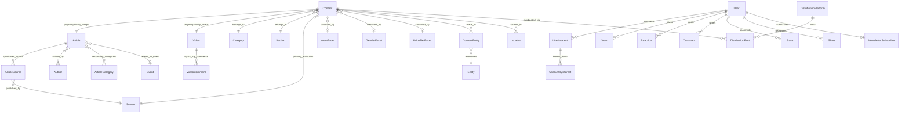
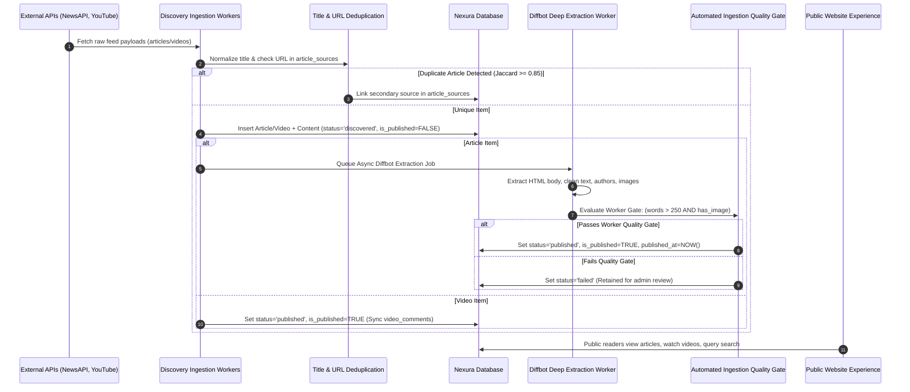
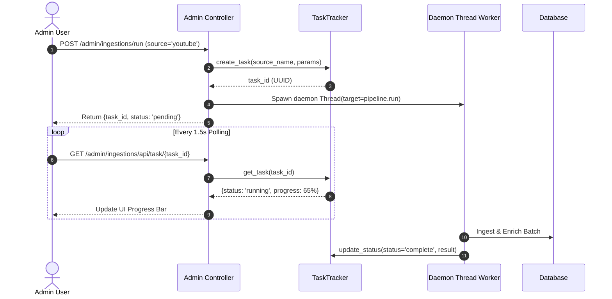

# Nexura Unified System Specification (Phase 7 Master Truth)

This document is the **authoritative, self-contained, implementation-ready architectural and engineering specification** for the rebuilt **Nexura** content platform. It defines the core domain models, cleansed relational database schema, multi-source ingestion pipelines, deep extraction workflows, public presentation architecture, administrative operations, recommendation algorithms, closed-loop analytics, and cross-cutting performance and security standards.

---

## 1. Nexura Overview

**Nexura** is an intelligent, high-performance media publishing and content discovery platform that ingests, enriches, and organizes global technology journalism, articles, and video reviews into a structured 8-dimensional taxonomy. Built on a server-rendered **Python 3.11+ / Flask 3.x / Jinja2 / SQLAlchemy 2.x / PostgreSQL** architecture with modular vanilla JavaScript, Nexura combines automated multi-source ingestion (NewsAPI, YouTube Data API, Diffbot extraction) with automated quality gating, multi-signal recommendation ranking, an explicit audience interest graph, closed-loop editorial intelligence, and multichannel social syndication—delivering sub-50ms content discovery, zero N+1 database queries, and pure SEO efficiency without client-side single-page application bloat.

---

## 2. Product Vision

### 2.1 The Problem Nexura Solves
Modern digital media is fragmented, cluttered with low-quality syndication, and overwhelmed by intrusive client-heavy JavaScript frameworks that degrade mobile performance and search engine indexing. Readers struggle to find authoritative, in-depth technical articles and video reviews organized cleanly by topic, brand, and editorial intent. At the same time, editorial teams lack data-driven intelligence to identify content demand gaps, monitor traffic decay, and orchestrate cross-platform syndication.

### 2.2 Core Purpose & Target Audience
* **For Readers**: A blazing-fast, distraction-free discovery hub to read verified tech journalism, watch curated video reviews with zero initial iframe overhead, explore topic taxonomies, bookmark collections, and receive transparently personalized content feeds.
* **For Editors & Curators**: An operational workbench to monitor automated ingestion pipelines, inspect document extraction health, filter promotional spam from video descriptions, resolve duplicate stories, eliminate orphan taxonomy nodes, and track audience demand gaps.

### 2.3 Key Architectural Differentiators
1. **Unified Multi-Format Media Contract**: Seamlessly integrates long-form written journalism (`Article`) and streaming video reviews (`Video`) under a single universal content contract (`Content`).
2. **Explicit 8-Dimensional Taxonomy**: Content is classified across 8 orthogonal dimensions (Sections, Categories, Topics, Brands, Geographic Locations, Editorial Intent, Gender, Price Tier).
3. **Auditable Recommendation & Interest Modeling**: Personalization is driven by transparent, relational affinity scores rather than unexplainable neural vectors.
4. **Closed-Loop Editorial Intelligence**: Tracks real-world CTR against predicted baselines to detect title/hook mismatches, content decay ($\ge 15\%$ traffic drops), and unserved audience demand.
5. **Zero-Bloat Engineering**: Delivers rich interactive experiences (progressive reveal, non-destructive search highlighting, lazy video facades) using modern CSS tokens and event delegation with zero React or Tailwind dependencies.

---

## 3. Capability Matrix

```
┌─────────────────────────────────────────────────────────────────────────────┐
│                          NEXURA CAPABILITY MATRIX                           │
├────────────────────────────────┬─────────────────┬──────────────────────────┤
│ Capability                     │ Tier            │ Operational Objective    │
├────────────────────────────────┼─────────────────┼──────────────────────────┤
│ Unified Multi-Source Ingestion │ 1. Essential    │ Ingest articles & videos │
│ Diffbot & Scraper Extraction   │ 1. Essential    │ 2-phase deep extraction  │
│ Automated Ingestion Gate       │ 1. Essential    │ Binary length/media rule │
│ Editorial Readiness Index      │ 1. Essential    │ 0–100 inspection score   │
│ Multi-Signal Content Relevance │ 1. Essential    │ Topic/Brand/Decay ranking│
│ Explicit User Interest Graph   │ 1. Essential    │ Relational user affinity │
│ Unified Search & Intent Scoring│ 1. Essential    │ Fast query rank & intent │
│ Consolidated Editorial Ops     │ 1. Essential    │ Content library & merge  │
│ 8-Dimension Taxonomy System    │ 1. Essential    │ Fuzzy merge & tag health │
│ Demand vs Supply Matrix        │ 1. Essential    │ Demand-gap discovery     │
├────────────────────────────────┼─────────────────┼──────────────────────────┤
│ Sentiment Analysis on Comments │ 2. Supporting   │ HuggingFace sentiment API│
│ Content Strategy Generator     │ 2. Supporting   │ Editorial angle planner  │
│ Traffic Decay Detection        │ 2. Supporting   │ 30d traffic drop alerts  │
│ Workload-Capped Calendar       │ 2. Supporting   │ 30-day publishing plan   │
│ Multichannel Syndication       │ 2. Supporting   │ Cross-platform post mgmt │
│ Strategy Accuracy Feedback     │ 2. Supporting   │ Baseline CTR diagnostics │
├────────────────────────────────┼─────────────────┼──────────────────────────┤
│ Strategy Memory Layer          │ 3. Experimental │ Outcome history lookup   │
│ Autonomous Bot Publishing      │ 3. Experimental │ Automated adapter bots   │
└────────────────────────────────┴─────────────────┴──────────────────────────┘
```

---

## 4. Domain Model & Relational Architecture



### 4.1 Domain Entity Separation & Ownership Rules

1. **`Content` (Master Aggregator & Public Entry Point)**:
   * **Ownership**: Owns global content identity, visibility (`is_published`, `is_active`), aggregated engagement counters (`view_count`, `like_count`, `dislike_count`, `save_count`, `comment_count`), taxonomy foreign keys (`section_id`, `category_id`, `source_id`, `intent_id`, `gender_id`, `price_tier_id`), full-text search fields (`search_text`, `search_vector`), and scoring cache columns (`score`, `review_score`, `review_count`).
   * **Authoritative Truth**: `contents.title` and `contents.published_at` are authoritative for all listing, search, feed, and card displays.
2. **`Article` (Written Journalism & Long-Form Content)**:
   * **Ownership**: Owns extracted body HTML (`content_html`), plain text (`content_text`), summary, word count, estimated reading time, canonical URL (`canonical_url`), language, lifecycle status (`discovered`, `enriching`, `ready`, `published`, `failed`, `archived`), extraction priority, and media payload blocks (`images`, `videos`).
3. **`Video` (Streaming & Visual Media)**:
   * **Ownership**: Owns external video metadata (`platform='youtube'`, `external_id`, `channel_name`, `creator`, `duration_seconds`, `thumbnail_url`, `description`, `description_display_rule`, `comments_count`, `view_count`, `like_count`, `platform_metadata`).
   * **External vs. Internal Metrics**: `videos.view_count` and `videos.like_count` represent external YouTube platform statistics; `contents.view_count` and `contents.like_count` represent on-platform reader engagement.
4. **`VideoComment` (Community Discussion Sync)**:
   * **Ownership**: Owns synchronized top comments for YouTube videos (`external_id`, `author_name`, `author_channel_id`, `text`, `like_count`, `reply_count`, `published_at`).
5. **`Author` (Journalists, Creators & Curators)**:
   * **Ownership**: Owns canonical author identity (`name`, `slug`, `url`, `uri`, `icon_url`, `is_agency`, `aliases`).
6. **`Source` (Publishers, Outlets & Channels)**:
   * **Ownership**: Owns media outlet profile (`name`, `slug`, `domain`, `external_uri`, `authority_score`, `logo_url`, `is_active`).
7. **`Event` (Editorial News & Product Launches)**:
   * **Ownership**: Owns scheduled launch or industry news events (`title`, `event_date`, `external_uri`, `event_type`, `summary`, `image_url`) linked to articles.
8. **`Taxonomy Entities`**:
   * **`Section`**: High-level domain partition (e.g. Technology, Lifestyle).
   * **`Category`**: Hierarchical topic cluster with `parent_id` and `is_leaf` flag.
   * **`Entity`**: Universal named entity (Brands, Topics, Concepts, Tags) with `wikidata_id` and `wikipedia_url`.
   * **`Location`**: Geographic country/region (`name`, `slug`, `country_code`, `latitude`, `longitude`).
   * **`IntentFacet` / `GenderFacet` / `PriceTierFacet`**: Dimensional classification facets.
9. **`User & Interactions (Clean Relational Architecture)`**:
   * Registered users (`User`), reading history (`View`), positive/negative endorsements (`Reaction`), threaded discussions (`Comment`), bookmark collections (`Save`), and social shares (`Share`).

---

## 5. Authoritative Database Schema & SQL DDL

The database schema contract represents the **cleansed, content-only relational architecture**, strictly preserving all required fields, foreign keys, indexes, and constraints while removing legacy commercial product tables and unnecessary polymorphic overhead:

```sql
-- ============================================================================
-- 1. TAXONOMY & REFERENCE TABLES
-- ============================================================================

CREATE TABLE sections (
    id SERIAL PRIMARY KEY,
    name VARCHAR(100) NOT NULL UNIQUE,
    slug VARCHAR(120) NOT NULL UNIQUE,
    description TEXT,
    allowed_filters JSON,
    is_active BOOLEAN DEFAULT TRUE NOT NULL,
    sort_order INTEGER DEFAULT 0 NOT NULL
);
CREATE INDEX ix_sections_slug ON sections (slug);

CREATE TABLE categories (
    id SERIAL PRIMARY KEY,
    external_uri VARCHAR(255) UNIQUE,
    name VARCHAR(255) NOT NULL,
    normalized_name VARCHAR(255),
    slug VARCHAR(255) NOT NULL UNIQUE,
    parent_id INTEGER REFERENCES categories(id) ON DELETE CASCADE,
    is_active BOOLEAN DEFAULT TRUE NOT NULL,
    sort_order INTEGER DEFAULT 0 NOT NULL,
    is_leaf BOOLEAN DEFAULT TRUE NOT NULL
);
CREATE INDEX ix_categories_slug ON categories (slug);
CREATE INDEX ix_categories_external_uri ON categories (external_uri);
CREATE INDEX ix_categories_normalized_name ON categories (normalized_name);
CREATE INDEX ix_categories_is_leaf ON categories (is_leaf);

CREATE TABLE sources (
    id SERIAL PRIMARY KEY,
    external_uri VARCHAR(255) UNIQUE,
    name VARCHAR(100) NOT NULL,
    slug VARCHAR(100) NOT NULL UNIQUE,
    domain VARCHAR(255) NOT NULL UNIQUE,
    logo_url TEXT,
    is_active BOOLEAN DEFAULT TRUE NOT NULL,
    authority_score INTEGER DEFAULT 50 NOT NULL
);
CREATE INDEX ix_sources_slug ON sources (slug);
CREATE INDEX ix_sources_domain ON sources (domain);
CREATE INDEX ix_sources_external_uri ON sources (external_uri);

CREATE TABLE entities (
    id SERIAL PRIMARY KEY,
    name VARCHAR(255) NOT NULL,
    slug VARCHAR(255) NOT NULL UNIQUE,
    external_uri VARCHAR(255) UNIQUE,
    entity_type VARCHAR(50), -- 'brand', 'topic', 'concept', 'organization', 'person', 'tag'
    image_url TEXT,
    provider VARCHAR(30),
    description TEXT,
    aliases JSON,
    wikidata_id VARCHAR(50),
    wikipedia_url TEXT
);
CREATE INDEX ix_entities_slug ON entities (slug);
CREATE INDEX ix_entities_external_uri ON entities (external_uri);
CREATE INDEX ix_entities_type ON entities (entity_type);
CREATE INDEX ix_entities_wikidata_id ON entities (wikidata_id);

CREATE TABLE locations (
    id SERIAL PRIMARY KEY,
    name VARCHAR(150) NOT NULL,
    slug VARCHAR(150) NOT NULL UNIQUE,
    country_code VARCHAR(10),
    country_name VARCHAR(150),
    latitude FLOAT,
    longitude FLOAT
);
CREATE INDEX ix_locations_slug ON locations (slug);
CREATE INDEX ix_locations_country_code ON locations (country_code);

CREATE TABLE intent_facets (
    id SERIAL PRIMARY KEY,
    name VARCHAR(80) NOT NULL UNIQUE,
    slug VARCHAR(80) NOT NULL UNIQUE
);

CREATE TABLE gender_facets (
    id SERIAL PRIMARY KEY,
    name VARCHAR(50) NOT NULL UNIQUE,
    slug VARCHAR(50) NOT NULL UNIQUE
);

CREATE TABLE price_tier_facets (
    id SERIAL PRIMARY KEY,
    name VARCHAR(50) NOT NULL UNIQUE,
    slug VARCHAR(50) NOT NULL UNIQUE
);

CREATE TABLE events (
    id SERIAL PRIMARY KEY,
    title VARCHAR(255) NOT NULL,
    event_date TIMESTAMP WITH TIME ZONE,
    external_uri VARCHAR(255),
    event_type VARCHAR(50),
    summary TEXT,
    image_url TEXT
);

-- ============================================================================
-- 2. CORE CONTENT & SPECIFIC MEDIA TABLES
-- ============================================================================

CREATE TABLE contents (
    id SERIAL PRIMARY KEY,
    object_type VARCHAR(20) NOT NULL, -- 'article' | 'video'
    object_id INTEGER NOT NULL,
    published_at TIMESTAMP WITH TIME ZONE NOT NULL,
    ingested_at TIMESTAMP WITH TIME ZONE DEFAULT CURRENT_TIMESTAMP,
    title TEXT,
    preview_text TEXT,
    search_text TEXT,
    search_vector TSVECTOR,
    is_active BOOLEAN DEFAULT TRUE NOT NULL,
    is_published BOOLEAN DEFAULT FALSE NOT NULL,
    like_count INTEGER DEFAULT 0 NOT NULL,
    dislike_count INTEGER DEFAULT 0 NOT NULL,
    share_count INTEGER DEFAULT 0 NOT NULL,
    save_count INTEGER DEFAULT 0 NOT NULL,
    comment_count INTEGER DEFAULT 0 NOT NULL,
    view_count INTEGER DEFAULT 0 NOT NULL,
    score FLOAT DEFAULT 0.0 NOT NULL,
    review_score FLOAT DEFAULT 0.0 NOT NULL,
    review_count INTEGER DEFAULT 0 NOT NULL,
    category_id INTEGER REFERENCES categories(id) ON DELETE SET NULL,
    section_id INTEGER NOT NULL REFERENCES sections(id) ON DELETE RESTRICT,
    gender_id INTEGER REFERENCES gender_facets(id) ON DELETE SET NULL,
    intent_id INTEGER REFERENCES intent_facets(id) ON DELETE SET NULL,
    price_tier_id INTEGER REFERENCES price_tier_facets(id) ON DELETE SET NULL,
    source_id INTEGER REFERENCES sources(id) ON DELETE SET NULL,
    ingestion_origin VARCHAR(50),
    CONSTRAINT uq_contents_object_type_id UNIQUE (object_type, object_id),
    CONSTRAINT ck_contents_object_type_valid CHECK (object_type IN ('article', 'video'))
);
CREATE INDEX ix_contents_published_at ON contents (published_at);
CREATE INDEX ix_contents_active ON contents (is_active);
CREATE INDEX ix_contents_view_count ON contents (view_count);
CREATE INDEX ix_contents_score ON contents (score);
CREATE INDEX ix_contents_review_score ON contents (review_score);
CREATE INDEX ix_contents_review_count ON contents (review_count);
CREATE INDEX ix_contents_section_id ON contents (section_id);
CREATE INDEX ix_contents_category_id ON contents (category_id);
CREATE INDEX ix_contents_category_published_at ON contents (category_id, published_at);
CREATE INDEX ix_contents_section_published_at ON contents (section_id, published_at);
CREATE INDEX ix_contents_active_published_at ON contents (is_active, published_at);
CREATE INDEX ix_contents_search_vector ON contents USING gin (search_vector);
CREATE INDEX ix_contents_title ON contents (title);

CREATE TABLE articles (
    id SERIAL PRIMARY KEY,
    title VARCHAR(300) NOT NULL,
    description TEXT,
    summary TEXT,
    body TEXT,
    content_text TEXT,
    content_html TEXT,
    word_count INTEGER,
    quality_score FLOAT DEFAULT 0.0 NOT NULL,
    enrichment_priority FLOAT DEFAULT 0.0 NOT NULL,
    ingestion_method VARCHAR(50),
    language VARCHAR(10),
    sentiment_score FLOAT,
    extended_metadata JSON,
    images JSON,
    videos JSON,
    status VARCHAR(20) DEFAULT 'discovered' NOT NULL,
    last_enrichment_attempt TIMESTAMP WITH TIME ZONE,
    image_url TEXT,
    canonical_url VARCHAR(500),
    event_id INTEGER REFERENCES events(id) ON DELETE SET NULL,
    primary_source_id INTEGER, -- FK added after article_sources
    CONSTRAINT ck_articles_status_valid CHECK (status IN ('discovered', 'enriching', 'ready', 'published', 'failed', 'archived'))
);
CREATE INDEX ix_articles_status ON articles (status);
CREATE INDEX ix_articles_enrichment_priority ON articles (enrichment_priority);
CREATE INDEX ix_articles_language ON articles (language);
CREATE INDEX ix_articles_sentiment_score ON articles (sentiment_score);
CREATE INDEX ix_articles_canonical_url ON articles (canonical_url);

CREATE TABLE authors (
    id SERIAL PRIMARY KEY,
    name VARCHAR(255) NOT NULL,
    slug VARCHAR(255) NOT NULL UNIQUE,
    url TEXT,
    uri VARCHAR(255),
    type VARCHAR(50),
    is_agency BOOLEAN DEFAULT FALSE NOT NULL,
    icon_url TEXT,
    aliases JSON
);
CREATE INDEX ix_authors_name ON authors (name);
CREATE INDEX ix_authors_slug ON authors (slug);

CREATE TABLE article_sources (
    id SERIAL PRIMARY KEY,
    article_id INTEGER NOT NULL REFERENCES articles(id) ON DELETE CASCADE,
    source_id INTEGER NOT NULL REFERENCES sources(id) ON DELETE RESTRICT,
    url TEXT NOT NULL UNIQUE,
    published_at TIMESTAMP WITH TIME ZONE
);
CREATE INDEX ix_article_sources_published_at ON article_sources (published_at);
ALTER TABLE articles ADD CONSTRAINT fk_articles_primary_source 
    FOREIGN KEY (primary_source_id) REFERENCES article_sources(id) ON DELETE SET NULL;

CREATE TABLE article_authors (
    article_id INTEGER NOT NULL REFERENCES articles(id) ON DELETE CASCADE,
    author_id INTEGER NOT NULL REFERENCES authors(id) ON DELETE CASCADE,
    PRIMARY KEY (article_id, author_id)
);
CREATE INDEX ix_article_authors_author ON article_authors (author_id);
CREATE INDEX ix_article_authors_article ON article_authors (article_id);

CREATE TABLE article_categories (
    article_id INTEGER NOT NULL REFERENCES articles(id) ON DELETE CASCADE,
    category_id INTEGER NOT NULL REFERENCES categories(id) ON DELETE CASCADE,
    weight FLOAT DEFAULT 0.0 NOT NULL,
    PRIMARY KEY (article_id, category_id)
);
CREATE INDEX ix_article_categories_category ON article_categories (category_id);
CREATE INDEX ix_article_categories_article ON article_categories (article_id);

CREATE TABLE videos (
    id SERIAL PRIMARY KEY,
    external_id VARCHAR(100) NOT NULL,
    platform VARCHAR(50) DEFAULT 'youtube' NOT NULL,
    title VARCHAR(300) NOT NULL,
    description TEXT,
    description_display_rule VARCHAR(20) DEFAULT 'review' NOT NULL,
    thumbnail_url TEXT,
    channel_name VARCHAR(150),
    channel_id VARCHAR(100),
    url TEXT,
    creator VARCHAR(150),
    published_at TIMESTAMP WITH TIME ZONE DEFAULT CURRENT_TIMESTAMP,
    duration_seconds INTEGER,
    view_count BIGINT DEFAULT 0 NOT NULL,
    like_count BIGINT DEFAULT 0 NOT NULL,
    comments_count INTEGER DEFAULT 0 NOT NULL,
    platform_metadata JSONB,
    CONSTRAINT uq_videos_external_platform UNIQUE (external_id, platform)
);
CREATE INDEX ix_videos_platform_published ON videos (platform, published_at);
CREATE INDEX ix_videos_platform_creator ON videos (platform, creator);

CREATE TABLE video_comments (
    id SERIAL PRIMARY KEY,
    video_id INTEGER NOT NULL REFERENCES videos(id) ON DELETE CASCADE,
    external_id VARCHAR(100) NOT NULL UNIQUE,
    author_name VARCHAR(150),
    author_channel_id VARCHAR(100),
    text TEXT NOT NULL,
    like_count INTEGER DEFAULT 0 NOT NULL,
    reply_count INTEGER DEFAULT 0 NOT NULL,
    published_at TIMESTAMP WITH TIME ZONE,
    updated_at TIMESTAMP WITH TIME ZONE
);
CREATE INDEX ix_video_comments_external_id ON video_comments (external_id);
CREATE INDEX ix_video_comments_published_at ON video_comments (published_at);

CREATE TABLE content_entities (
    content_id INTEGER NOT NULL REFERENCES contents(id) ON DELETE CASCADE,
    entity_id INTEGER NOT NULL REFERENCES entities(id) ON DELETE CASCADE,
    relevance_score FLOAT DEFAULT 0.0,
    origin VARCHAR(30), -- 'diffbot', 'rule', 'manual'
    confidence FLOAT,
    PRIMARY KEY (content_id, entity_id)
);
CREATE INDEX ix_content_entities_entity_content ON content_entities (entity_id, content_id);

CREATE TABLE content_locations (
    content_id INTEGER NOT NULL REFERENCES contents(id) ON DELETE CASCADE,
    location_id INTEGER NOT NULL REFERENCES locations(id) ON DELETE CASCADE,
    PRIMARY KEY (content_id, location_id)
);
CREATE INDEX ix_content_locations_location ON content_locations (location_id);
CREATE INDEX ix_content_locations_content ON content_locations (content_id);

-- ============================================================================
-- 3. USER, AUTHENTICATION & INTERACTION TABLES
-- ============================================================================

CREATE TABLE users (
    id SERIAL PRIMARY KEY,
    email VARCHAR(150) NOT NULL UNIQUE,
    name VARCHAR(120),
    password_hash TEXT NOT NULL,
    google_id TEXT UNIQUE,
    provider TEXT,
    created_at TIMESTAMP WITH TIME ZONE DEFAULT CURRENT_TIMESTAMP,
    is_admin BOOLEAN DEFAULT FALSE NOT NULL,
    is_active BOOLEAN DEFAULT TRUE NOT NULL,
    is_verified BOOLEAN DEFAULT FALSE NOT NULL,
    verified_at TIMESTAMP WITH TIME ZONE,
    verification_sent_at TIMESTAMP WITH TIME ZONE,
    last_login_at TIMESTAMP WITH TIME ZONE,
    password_changed_at TIMESTAMP WITH TIME ZONE,
    password_reset_token VARCHAR(255),
    password_reset_sent_at TIMESTAMP WITH TIME ZONE,
    CONSTRAINT ck_google_user CHECK ((google_id IS NULL AND provider IS NULL) OR (google_id IS NOT NULL AND provider IS NOT NULL))
);
CREATE INDEX ix_users_email ON users (email);

CREATE TABLE newsletter_subscribers (
    id SERIAL PRIMARY KEY,
    email VARCHAR(150) NOT NULL UNIQUE,
    user_id INTEGER REFERENCES users(id) ON DELETE SET NULL,
    is_confirmed BOOLEAN DEFAULT FALSE NOT NULL,
    created_at TIMESTAMP WITH TIME ZONE DEFAULT CURRENT_TIMESTAMP,
    unsubscribed_at TIMESTAMP WITH TIME ZONE,
    confirmation_token VARCHAR(255),
    unsubscribe_token VARCHAR(255)
);
CREATE INDEX ix_newsletter_subscribers_email ON newsletter_subscribers (email);

CREATE TABLE contact_messages (
    id SERIAL PRIMARY KEY,
    name VARCHAR(120) NOT NULL,
    email VARCHAR(120) NOT NULL,
    subject VARCHAR(200) NOT NULL,
    message TEXT NOT NULL,
    ip_address VARCHAR(45),
    user_agent VARCHAR(255),
    created_at TIMESTAMP WITH TIME ZONE DEFAULT CURRENT_TIMESTAMP
);
CREATE INDEX ix_contact_messages_created_at ON contact_messages (created_at);

CREATE TABLE views (
    id SERIAL PRIMARY KEY,
    user_id INTEGER REFERENCES users(id) ON DELETE CASCADE,
    content_id INTEGER NOT NULL REFERENCES contents(id) ON DELETE CASCADE,
    ip_address VARCHAR(45),
    created_at TIMESTAMP WITH TIME ZONE DEFAULT CURRENT_TIMESTAMP,
    CONSTRAINT ck_view_one_identity CHECK ((user_id IS NOT NULL AND ip_address IS NULL) OR (user_id IS NULL AND ip_address IS NOT NULL))
);
CREATE UNIQUE INDEX uq_views_auth ON views (user_id, content_id) WHERE user_id IS NOT NULL;
CREATE UNIQUE INDEX uq_views_anon ON views (ip_address, content_id) WHERE user_id IS NULL;
CREATE INDEX ix_views_content ON views (content_id);

CREATE TABLE saves (
    id SERIAL PRIMARY KEY,
    user_id INTEGER NOT NULL REFERENCES users(id) ON DELETE CASCADE,
    content_id INTEGER NOT NULL REFERENCES contents(id) ON DELETE CASCADE,
    collection_name VARCHAR(100) DEFAULT 'General',
    created_at TIMESTAMP WITH TIME ZONE DEFAULT CURRENT_TIMESTAMP,
    CONSTRAINT uq_user_save_collection UNIQUE (user_id, content_id, collection_name)
);
CREATE INDEX ix_saves_content ON saves (content_id);

CREATE TABLE reactions (
    id SERIAL PRIMARY KEY,
    user_id INTEGER NOT NULL REFERENCES users(id) ON DELETE CASCADE,
    target_type VARCHAR(20) NOT NULL CHECK (target_type IN ('content', 'comment')),
    target_id INTEGER NOT NULL,
    type VARCHAR(20) NOT NULL, -- 'like' | 'dislike'
    created_at TIMESTAMP WITH TIME ZONE DEFAULT CURRENT_TIMESTAMP,
    CONSTRAINT unique_user_reaction UNIQUE (user_id, target_type, target_id)
);
CREATE INDEX ix_reactions_target ON reactions (target_type, target_id);

CREATE TABLE comments (
    id SERIAL PRIMARY KEY,
    user_id INTEGER NOT NULL REFERENCES users(id) ON DELETE CASCADE,
    content_id INTEGER NOT NULL REFERENCES contents(id) ON DELETE CASCADE,
    parent_id INTEGER REFERENCES comments(id) ON DELETE CASCADE,
    content TEXT NOT NULL DEFAULT '',
    created_at TIMESTAMP WITH TIME ZONE DEFAULT CURRENT_TIMESTAMP,
    sentiment VARCHAR(20),
    confidence FLOAT,
    like_count INTEGER DEFAULT 0 NOT NULL,
    dislike_count INTEGER DEFAULT 0 NOT NULL,
    share_count INTEGER DEFAULT 0 NOT NULL,
    replies_count INTEGER DEFAULT 0 NOT NULL
);
CREATE INDEX ix_comments_content ON comments (content_id);
CREATE INDEX ix_comments_parent ON comments (parent_id);

CREATE TABLE shares (
    id SERIAL PRIMARY KEY,
    user_id INTEGER NOT NULL REFERENCES users(id) ON DELETE CASCADE,
    content_id INTEGER NOT NULL REFERENCES contents(id) ON DELETE CASCADE,
    channel VARCHAR(50),
    created_at TIMESTAMP WITH TIME ZONE DEFAULT CURRENT_TIMESTAMP
);
CREATE INDEX ix_shares_content ON shares (content_id);
CREATE INDEX ix_shares_user_created ON shares (user_id, created_at);

-- ============================================================================
-- 4. RECOMMENDATION & AUDIENCE INTEREST GRAPH
-- ============================================================================

CREATE TABLE user_interests (
    id SERIAL PRIMARY KEY,
    user_id INTEGER NOT NULL REFERENCES users(id) ON DELETE CASCADE,
    content_id INTEGER NOT NULL REFERENCES contents(id) ON DELETE CASCADE,
    interaction_count INTEGER DEFAULT 0 NOT NULL,
    last_interaction_at TIMESTAMP WITH TIME ZONE DEFAULT CURRENT_TIMESTAMP,
    CONSTRAINT uq_user_content_interest UNIQUE (user_id, content_id)
);
CREATE INDEX ix_user_interest_lookup ON user_interests (user_id, content_id);

CREATE TABLE user_entity_interests (
    id SERIAL PRIMARY KEY,
    user_interest_id INTEGER NOT NULL REFERENCES user_interests(id) ON DELETE CASCADE,
    entity_id INTEGER REFERENCES entities(id) ON DELETE CASCADE,
    category_id INTEGER REFERENCES categories(id) ON DELETE CASCADE,
    score FLOAT DEFAULT 0.0 NOT NULL,
    CONSTRAINT ck_user_entity_ref CHECK (entity_id IS NOT NULL OR category_id IS NOT NULL)
);
CREATE INDEX ix_user_entity_interest_ref ON user_entity_interests (entity_id, category_id);

CREATE TABLE recommendation_impressions (
    id SERIAL PRIMARY KEY,
    entity_type VARCHAR(50) NOT NULL, -- 'content'
    context_id VARCHAR(100),
    entity_ids JSON NOT NULL,
    created_at TIMESTAMP WITH TIME ZONE DEFAULT CURRENT_TIMESTAMP,
    user_id INTEGER REFERENCES users(id) ON DELETE SET NULL
);
CREATE INDEX ix_rec_impressions_created ON recommendation_impressions (created_at);

CREATE TABLE recommendation_clicks (
    id SERIAL PRIMARY KEY,
    entity_type VARCHAR(50) NOT NULL, -- 'content'
    entity_id VARCHAR(100) NOT NULL,
    context_id VARCHAR(100),
    created_at TIMESTAMP WITH TIME ZONE DEFAULT CURRENT_TIMESTAMP,
    user_id INTEGER REFERENCES users(id) ON DELETE SET NULL
);
CREATE INDEX ix_rec_clicks_created ON recommendation_clicks (created_at);

-- ============================================================================
-- 5. MULTICHANNEL CONTENT SYNDICATION
-- ============================================================================

CREATE TABLE distribution_platforms (
    id SERIAL PRIMARY KEY,
    name VARCHAR(50) NOT NULL UNIQUE, -- 'youtube', 'pinterest', 'instagram', 'facebook', 'tiktok'
    is_active BOOLEAN DEFAULT TRUE NOT NULL,
    created_at TIMESTAMP WITH TIME ZONE DEFAULT CURRENT_TIMESTAMP
);

CREATE TABLE distribution_posts (
    id SERIAL PRIMARY KEY,
    platform_id INTEGER NOT NULL REFERENCES distribution_platforms(id) ON DELETE CASCADE,
    content_id INTEGER NOT NULL REFERENCES contents(id) ON DELETE CASCADE,
    status VARCHAR(20) DEFAULT 'draft' NOT NULL, -- 'draft', 'scheduled', 'published'
    platform_specific_text TEXT,
    external_url TEXT,
    publish_date TIMESTAMP WITH TIME ZONE,
    views_count INTEGER DEFAULT 0 NOT NULL,
    likes_count INTEGER DEFAULT 0 NOT NULL,
    clicks_count INTEGER DEFAULT 0 NOT NULL,
    shares_count INTEGER DEFAULT 0 NOT NULL,
    created_at TIMESTAMP WITH TIME ZONE DEFAULT CURRENT_TIMESTAMP,
    updated_at TIMESTAMP WITH TIME ZONE DEFAULT CURRENT_TIMESTAMP
);
CREATE INDEX ix_distribution_posts_content ON distribution_posts (content_id);
CREATE INDEX ix_distribution_posts_status ON distribution_posts (status);
CREATE INDEX ix_distribution_posts_publish_date ON distribution_posts (publish_date);
```

---

## 6. Relationship, Cardinality & Foreign Key Rules

```
┌──────────────────────────────────────┬─────────────┬────────────────────────────────────────────────────────┐
│ Relationship                         │ Cardinality │ Referential Integrity Rule                             │
├──────────────────────────────────────┼─────────────┼────────────────────────────────────────────────────────┤
│ `Content` → `Section`                │ Many-to-One │ `section_id` NOT NULL, ON DELETE RESTRICT              │
├──────────────────────────────────────┼─────────────┼────────────────────────────────────────────────────────┤
│ `Content` → `Category`               │ Many-to-One │ `category_id` NULL, ON DELETE SET NULL                 │
├──────────────────────────────────────┼─────────────┼────────────────────────────────────────────────────────┤
│ `Content` → `Source`                 │ Many-to-One │ `source_id` NULL, ON DELETE SET NULL                   │
├──────────────────────────────────────┼─────────────┼────────────────────────────────────────────────────────┤
│ `Content` → `Article` / `Video`      │ 1:1 Polym.  │ Unique (object_type, object_id)                        │
├──────────────────────────────────────┼─────────────┼────────────────────────────────────────────────────────┤
│ `Article` → `ArticleSource`          │ 1-to-Many   │ `article_sources.article_id` CASCADE                   │
├──────────────────────────────────────┼─────────────┼────────────────────────────────────────────────────────┤
│ `ArticleSource` → `Source`           │ Many-to-One │ `article_sources.source_id` RESTRICT                   │
├──────────────────────────────────────┼─────────────┼────────────────────────────────────────────────────────┤
│ `Article` → `Author`                 │ Many-to-Many│ `article_authors` junction, CASCADE                    │
├──────────────────────────────────────┼─────────────┼────────────────────────────────────────────────────────┤
│ `Article` → `Category` (Secondary)   │ Many-to-Many│ `article_categories` junction with `weight`, CASCADE   │
├──────────────────────────────────────┼─────────────┼────────────────────────────────────────────────────────┤
│ `Video` → `VideoComment`             │ 1-to-Many   │ `video_comments.video_id` CASCADE                      │
├──────────────────────────────────────┼─────────────┼────────────────────────────────────────────────────────┤
│ `Content` → `Entity`                 │ Many-to-Many│ `content_entities` junction (`origin`, `conf`), CASCADE│
├──────────────────────────────────────┼─────────────┼────────────────────────────────────────────────────────┤
│ `Content` → `Location`               │ Many-to-Many│ `content_locations` junction, CASCADE                  │
├──────────────────────────────────────┼─────────────┼────────────────────────────────────────────────────────┤
│ `User` → `View` / `Save` / `Share`   │ 1-to-Many   │ Foreign key `user_id` CASCADE                          │
├──────────────────────────────────────┼─────────────┼────────────────────────────────────────────────────────┤
│ `Comment` → `Comment` (Replies)      │ 1-to-Many   │ `parent_id` self-reference CASCADE                     │
├──────────────────────────────────────┼─────────────┼────────────────────────────────────────────────────────┤
│ `User` → `UserInterest`              │ 1-to-Many   │ `user_id` CASCADE, unique (user_id, content_id)        │
├──────────────────────────────────────┼─────────────┼────────────────────────────────────────────────────────┤
│ `DistributionPost` → `Content`       │ Many-to-One │ `content_id` CASCADE                                   │
└──────────────────────────────────────┴─────────────┴────────────────────────────────────────────────────────┘
```

---

## 7. Content Ingestion Architecture



---

## 8. Content Processing, Deep Extraction & Normalization

### 8.1 2-Phase Extraction Lifecycle
* **Phase 1 (Light Ingestion)**: Ingests title, URL, published timestamp, and short summary from NewsAPI or YouTube API feeds. Inserts `Article` with `status='discovered'` and creates the parent `Content` with `is_published=False`.
* **Phase 2 (Deep Extraction via Diffbot)**: Async background workers scrape the full article URL to extract:
  * Clean HTML body (`content_html`) with script/style tags stripped.
  * Extracted plain text (`content_text`) and word count calculation.
  * Primary author extraction with `Author.get_or_create` deduplication.
  * Extracted inline images, video embeds, and structured event metadata.

### 8.2 Text & HTML Sanitization Pipeline
All scraped content and user inputs pass through a mandatory 4-stage pipeline:
1. **Unescape Entities**: Decodes HTML entities (`&amp;` $\rightarrow$ `&`).
2. **Tag Filtering**: Completely strips dangerous tags (`<script>`, `<iframe>`, `<style>`, `<object>`). Retains only semantic markup (`<p>`, `<h2>`, `<h3>`, `<blockquote>`, `<ul>`, `<ol>`, `<li>`, `<a>`, `<code>`, `<pre>`, ``).
3. **Unicode Normalization**: Replaces non-breaking spaces (`\u00a0`) and non-breaking hyphens (`\u2011`, `\u2013`) with standard ASCII equivalents.
4. **Whitespace Collapsing**: Trims leading/trailing whitespace and collapses repeated spaces.

---

## 9. Ingestion Quality Gates & Editorial Readiness Index

### 9.1 Automated Ingestion Quality Gate (Worker Level)
When the background worker enriches an article via Diffbot, it executes an immediate, binary **Automated Ingestion Quality Gate**:

$$\text{AutoPublish} = (\text{Article.word\_count} > 250) \land (\text{Article.image\_url} \neq \text{null})$$

* **Outcome if True**: `article.status = 'published'`, `content.is_published = True`, `content.published_at = NOW()`, search vectors populated, and initial score calculated.
* **Outcome if False**: `article.status = 'failed'` (logged with reason: `too_short` or `no_media`, retained for administrative review).

### 9.2 Editorial Publishing Readiness Index (0–100 Admin Inspection Score)
Separate from the binary worker gate, the **Publishing Readiness Index** is a 5-dimension quality score evaluated in administrative inspection panels:

```
┌─────────────────────────────────────────────────────────────────────────────┐
│                    EDITORIAL READINESS INDEX (0–100)                        │
├─────────────────────┬────────┬──────────────────────────────────────────────┤
│ Component           │ Weight │ Verification Criteria                        │
├─────────────────────┼────────┼──────────────────────────────────────────────┤
│ Core Metadata       │ 25 pts │ Valid title, non-empty description, slug     │
├─────────────────────┼────────┼──────────────────────────────────────────────┤
│ Body & Extraction   │ 30 pts │ Word count >= 150, scraped HTML body present │
├─────────────────────┼────────┼──────────────────────────────────────────────┤
│ Taxonomy Mapping    │ 20 pts │ Category assigned, >= 2 Entity tags linked   │
├─────────────────────┼────────┼──────────────────────────────────────────────┤
│ Media Assets        │ 15 pts │ Valid high-res thumbnail / header image      │
├─────────────────────┼────────┼──────────────────────────────────────────────┤
│ Source Attribution  │ 10 pts │ Known publisher, source authority >= 40      │
└─────────────────────┴────────┴──────────────────────────────────────────────┘
```

* **Readiness Tiers**:
  * **`Ready` (80–100 pts)**: High-quality, complete article.
  * **`Almost Ready` (60–79 pts)**: Minor taxonomy or thumbnail gap.
  * **`Needs Work` (40–59 pts)**: Thin body or missing category.
  * **`Not Ready` (0–39 pts)**: Extraction failed or empty body.

### 9.3 Video Promotional & Spam Filter
YouTube descriptions are scanned using weighted regex patterns:
* **Affiliate & Shortener Links** (`bit.ly`, `amzn.to`): High severity ($0.4$).
* **Sponsorship Declarations** (`#ad`, `sponsored by`): High severity ($0.4$).
* **Subscription Prompts** (`like and subscribe`): Medium severity ($0.2$).
* **Display Rules**: `display` (clean description), `review` (minor promotion), `flag` (heavy links), `hide` (pure affiliate spam).

---

## 10. Deduplication & Canonical Content Selection

1. **Title Normalization**: Lowercases title, strips punctuation, and extracts alphanumeric word tokens.
2. **URL Canonicalization**: Strips tracking parameters (`utm_*`, `ref`, `fbclid`, `session`).
3. **Similarity Detection**: Computes token Jaccard similarity against existing articles published within a 7-day rolling window:
   $$J(A, B) = \frac{|T_A \cap T_B|}{|T_A \cup T_B|}$$
4. **Duplicate Resolution**:
   * If $J(A, B) \ge 0.85$: Identifies article $B$ as a syndicated duplicate of $A$.
   * Inserts $B$'s source URL into `article_sources` linked to $A$.
   * Does not create a duplicate `Content` record, preserving consolidated reader interaction signals on the canonical article.

---

## 11. Search Architecture, Full-Text Indexing & Autocomplete

### 11.1 PostgreSQL Full-Text Search Vector
* `contents.search_vector` is populated post-enrichment with weighted tsvector terms:
  * **Weight A**: `contents.title`
  * **Weight B**: `categories.name`, `sources.name`
  * **Weight C**: `contents.preview_text`, linked `entities.name`
* Indexed with a PostgreSQL GIN index (`ix_contents_search_vector`).

### 11.2 Multi-Factor Search Ranking Formula
Every candidate returned from full-text filtering is scored using a 4-component model:

$$\text{SearchScore}(C, Q) = 4.0 \cdot S_{\text{text}}(C, Q) + 0.8 \cdot S_{\text{pop}}(C) + 0.6 \cdot S_{\text{fresh}}(C) + 1.2 \cdot S_{\text{intent}}(C, Q)$$

* **Text Score ($S_{\text{text}}$)**: Exact phrase in title (+3.0), individual keyword in title (+1.2), keyword in preview/entities (+0.6).
* **Popularity Score ($S_{\text{pop}}$)**: $\ln(1 + \text{views} + \text{comments} + \text{reactions})$.
* **Freshness Score ($S_{\text{fresh}}$)**: $\frac{0.6}{1 + \text{age\_days} / 30}$.
* **Intent Score ($S_{\text{intent}}$)**: Boosts content matching query intent keywords (`buying-guide`, `review`, `comparison`, `tutorial`, `news`).

### 11.3 Search Autocomplete API (`GET /api/search/suggestions?q=...`)
* Rejects queries $< 2$ characters with `HTTP 400`.
* Cached in Redis / Memory for **60 seconds** (`suggestions:v1:<normalized_query>`).
* Returns JSON payload containing top 5 articles and top 5 videos with title, canonical URL, thumbnail, and category tag.

---

## 12. Public Routes & Endpoint Contract

| Route Endpoint | Method | Auth Req. | Response Type | View Objective & Behavior |
| :--- | :---: | :---: | :---: | :--- |
| **`/`** | GET | Public | HTML (SSR) | **Home Experience**: Hero carousel, section rows, personalized feed, trending categories. |
| **`/<section_slug>`** | GET | Public | HTML (SSR) | **Section Landing**: Filterable grid, active intent tabs, section hero, progressive reveal. |
| **`/<section_slug>/<category_slug>`** | GET | Public | HTML (SSR) | **Category Hub**: Curated category articles & videos, sub-category chips, intent filters. |
| **`/topic/<slug>`** | GET | Public | HTML (SSR) | **Topic / Brand Hub**: Aggregated content tagged with specific entity across all sections. |
| **`/article/<slug_or_id>`** | GET | Public | HTML (SSR) | **Article Detail**: Full reading view, author badge, reading time, reactions, related grid. |
| **`/video/<slug_or_id>`** | GET | Public | HTML (SSR) | **Video Detail**: Lazy YouTube player, channel profile, duration badge, synced comments. |
| **`/search`** | GET | Public | HTML (SSR) | **Unified Search**: Multi-factor ranked search results with query intent filters. |
| **`/api/search/suggestions`** | GET | Public | JSON | **Autocomplete Suggestions**: 60s cached search suggestions (top 5 articles/videos). |
| **`/library`** | GET | Authenticated | HTML (SSR) | **User Library**: Paginated user reading history and organized save collections. |
| **`/handle-interaction`** | POST | Authenticated | JSON | **User Reactions**: Handles like, dislike, save, and share submissions with CSRF check. |
| **`/comments/submit`** | POST | Authenticated | JSON | **Comment Submission**: Submits threaded comments with sentiment scoring. |
| **`/subscribe`** | POST | Public | JSON | **Newsletter Signup**: Creates `newsletter_subscribers` record with token confirmation. |

---

## 13. Public Page Presentation & Component Behavior

### 13.1 Article Detail Presentation
* **Header**: Large semantic `<h1>` title, primary author avatar and name, source publisher badge with authority rating, publication date with humanized age, and estimated reading time.
* **Hero Media**: High-resolution image with lightbox zoom capability.
* **Document Body**: Server-rendered HTML formatted with elevated typography, styled quotes, inline video embeds, structured data tables, and syntax-highlighted code snippets.
* **Interaction Bar**: Real-time Like/Dislike reaction buttons, Save to Collection modal, Share sheet (Twitter/X, Facebook, LinkedIn, Copy Link), and comment counter.
* **Sidebar / Footer**: Contextual Related Content grid (matching shared topics, brands, and categories), author profile box, and newsletter subscription box.

### 13.2 Video Detail Presentation
* **Player Facade**: High-res thumbnail with SVG play icon overlay; dynamically mounts YouTube iframe on click with `autoplay=1`.
* **Channel Meta**: YouTube channel title, duration badge (`MM:SS`), and view/like metrics.
* **Description Panel**: Cleaned video description with promotional spam links stripped or hidden behind an expandable disclosure.
* **Community Discussion**: Synced top comments rendered from `video_comments`.

---

## 14. User Accounts, Authentication & Security

1. **Password Hashing & Diversity**: Werkzeug-managed PBKDF2/Argon2 hashing with mandatory score-based password strength ($\ge 8$ chars, diversity scoring).
2. **Email Verification Lifecycle**: New registrations emit a confirmation token; `is_verified` is required for commenting and collection saving.
3. **Password Reset Workflow**: Secure time-limited tokens (`password_reset_token`, `password_reset_sent_at` with 1-hour expiration).
4. **Google OAuth 2.0 Integration**: Enforces `ck_google_user` check constraint ensuring `(google_id, provider)` integrity.
5. **Role-Based Authorization (`@admin_required`)**: Rejects unauthenticated requests with `HTTP 401` and non-admin users with `HTTP 403`.

---

## 15. User Library, Reading History & Collections

1. **Reading History (`views`)**:
   * Logs content interactions with partial unique indexes (`uq_views_auth` for authenticated users, `uq_views_anon` for anonymous visitors).
   * Displays paginated chronological reading history in `/library`.
2. **Saved Collections (`saves`)**:
   * Users can organize saved articles/videos into custom named collections (`collection_name` default `'General'`).
   * Enforces `uq_user_save_collection` uniqueness constraint.

---

## 16. Content Recommendation & Personalization Engine

### 16.1 Multi-Signal Content Relevance Formula

Candidate related content items are scored using a deterministic, multi-factor equation:

$$\text{RelevanceScore}(C_{\text{cand}}, C_{\text{ref}}) = 3.0 \cdot N_{\text{shared\_topics}} + 2.0 \cdot I_{\text{shared\_brand}} + 1.5 \cdot I_{\text{same\_category}} + 0.5 \cdot I_{\text{same\_section}} + 0.8 \cdot D(t) + 0.4 \cdot \ln(1 + V)$$

* **Recency Exponential Decay**: $D(t) = e^{-\frac{\ln(2) \cdot \Delta t}{30\text{ days}}}$.
* **Popularity Scaling**: $\ln(1 + \max(V, 0))$, where $V$ is total views.

### 16.2 Personalized Discovery Feed
* Reads user's last 20 read articles + all saved articles.
* Extracts user's top affinity vectors from `UserInterest` & `UserEntityInterest`.
* Queries published content matching top categories/brands, filtering out all `seen_content_ids`.
* Interleaves Category Recommendations ($50\%$) and Brand/Topic Recommendations ($50\%$).

---

## 17. Closed-Loop Analytics, Momentum & Traffic Decay

### 17.1 Demand vs. Supply Opportunity Matrix
* **Demand Metric**: Total views, likes, comments, and saves over the last 30 days per Category/Brand.
* **Volume Metric**: Total published articles and videos per Category/Brand.
* **Opportunity Gap Score**: $\text{Gap} = R_{\text{volume}} - R_{\text{demand}}$. High positive gaps are surfaced as **Priority Content Opportunities**.

### 17.2 7-Day & 14-Day Momentum Velocity
* Computes percentage engagement growth: $\Delta\% = \left(\frac{\text{Interactions}_{0-7\text{d}} - \text{Interactions}_{8-14\text{d}}}{\max(\text{Interactions}_{8-14\text{d}}, 1)}\right) \times 100\%$.
* Injects momentum velocity into editorial planning to prioritize breaking trends.

### 17.3 Content Traffic Decay Detection
* Identifies articles where traffic over days 0–30 is $\ge 15\%$ lower than days 31–60.
* Automatically schedules an **Update & Refresh** task in the publishing calendar to update outdated statistics, broken embeds, and taxonomy tags.

### 17.4 Closed-Loop Performance Feedback
* Compares real-world recommendation CTR against expected baselines:
  * $\text{CTR}_{\text{actual}} < 60\% \text{ expected} \rightarrow \text{Strategy Mismatch (Review taxonomy mapping)}$.
  * $\text{High impressions but CTR} < 5\% \rightarrow \text{Hook/Title Failure (Optimize headline/thumbnail)}$.
  * $\text{Clicks} > 10 \text{ but engagement} < 2\% \rightarrow \text{Content Mismatch (Improve body readability)}$.

---

## 18. Administrative Control Plane & Editorial Operations

Administrative capabilities are consolidated into **6 core operational areas**:

1. **Ingestion Health & Task Monitoring (`/admin/ingestions`)**:
   * Displays source provider status (NewsAPI, YouTube, Diffbot), API quota consumption, background worker health, and recent task execution logs.
   * Provides manual trigger controls with background async workers (`TaskTracker`).
2. **Content Library & Batch Operations (`/admin/contents`)**:
   * Multi-facet filter toolbar: Search query, content type (`article`/`video`), section, category, publishing status, and readiness tier.
   * Server-rendered row partials (`/rows`) with pagination header parsing (`X-Total`, `X-Pages`).
   * 1-click batch actions: `Publish`, `Unpublish`, `Activate`, `Deactivate`, `Recategorize`, `Delete`.
3. **Editorial Inspection & Extraction Quality (`/admin/contents/inspect`)**:
   * Inspects Publishing Readiness breakdown (0–100), Diffbot block extraction health, and video promotional confidence scores.
4. **Deduplication Workbench (`/admin/contents/deduplication`)**:
   * Groups duplicate stories across sources using tokenized Jaccard similarity.
   * Single-click **"Keep Oldest Only"** bulk resolution: canonicalizes older article, migrates sources, and unpublishes duplicates.
5. **Taxonomy & Entity Merge Workbench (`/admin/taxonomy`)**:
   * Manages 8 taxonomy dimensions.
   * Fuzzy duplicate detection ($\ge 85\%$ similarity) with atomic junction re-linking and redundant entity deletion.
6. **Community Safety & Discussion Moderation (`/admin/moderation`)**:
   * Moderates user comments, flags spam/offensive comments, and manages subscriber hygiene.

---

## 19. Community Moderation & Safety

1. **Sentiment & Spam Scoring**: External HuggingFace sentiment classifier scores comments upon submission.
2. **One-Click Moderation Actions**: Editors can approve, soft-delete, or hard-delete comments, automatically updating `contents.comment_count`.
3. **Rate Limiting**: Public comment submissions are limited to 30 requests per minute per IP.

---

## 20. Multichannel Content Syndication & Publishing

* **Syndication Hub (`DistributionPost`)**: Tracks editorial social posts across `YouTube`, `Pinterest`, `Instagram`, `Facebook`, and `TikTok`.
* **Automated Draft Generator**: Rule-based engine that transforms articles into platform-specific drafts:
  * **YouTube**: Video script outline with hook, timestamps, and description.
  * **Pinterest**: Visual cheat-sheet and infographic specifications.
  * **Instagram / Facebook**: Carousel slides and community discussion prompts.
  * **TikTok**: 0–3s hook and script outline.
* **Platform Engagement Index**: Computes weighted channel effectiveness: $\text{Index} = 2.0 \cdot \text{Likes} + 5.0 \cdot \text{Clicks} + 10.0 \cdot \text{Shares} + 0.1 \cdot \text{Views}$.

---

## 21. Backend Architecture & Background Task Isolation



1. **Background Job Isolation (`TaskTracker`)**: Long-running ingestion and Diffbot scraping jobs execute in background daemon threads.
2. **Atomic JSON File State**: Task progress is persisted atomically (`<task_id>.tmp` $\rightarrow$ `<task_id>.json`) allowing the UI to poll progress without blocking request threads.
3. **Application Context Safety**: Workers explicitly push `app.app_context()` and handle scoped database sessions with automatic rollback on error.

---

## 22. DTO, Serialization & Boundary Protocols

1. **DTO Boundary Invariant**: ORM entities never cross directly into templates or JSON responses.
2. **Tiered Serialization**:
   * `serialize_content_card`: Lightweight payload (titles, slugs, thumbnails, reading time, top 7 tags).
   * `serialize_content_detail`: Full payload (HTML body, authors, source authority tier, grouped entities).
3. **Payload Compaction (`compact_dict`)**: Recursively purges `None`, `""`, and `[]` from all dictionaries, shrinking network transfer by 30–50%.

---

## 23. Caching Architecture & Cascaded Invalidation

```
┌─────────────────────────────────────────────────────────────────────────────┐
│                          CACHE STORAGE & TTL POLICY                         │
├───────────────────────┬──────────────┬──────────────┬───────────────────────┤
│ Layer / Operation     │ Key Format   │ TTL          │ Invalidation Trigger  │
├───────────────────────┼──────────────┼──────────────┼───────────────────────┤
│ Layout Context        │ `layout_     │ 1 hour       │ Admin section/nav     │
│ (Header/Footer/Nav)   │ context`     │ (3600s)      │ modification.         │
├───────────────────────┼──────────────┼──────────────┼───────────────────────┤
│ Homepage & Feed Data  │ `home_page_  │ 5 minutes    │ New article published │
│                       │ data`        │ (300s)       │ or editorial change.  │
├───────────────────────┼──────────────┼──────────────┼───────────────────────┤
│ Filter Option Slugs   │ `filter_opts_│ 5 minutes    │ Taxonomy modification.│
│                       │ <section_id>`│ (300s)       │                       │
├───────────────────────┼──────────────┼──────────────┼───────────────────────┤
│ Content Static Page   │ `content_page│ 5 minutes    │ Content update / edit │
│                       │ _<id>`       │ (300s)       │ or re-scrape.         │
├───────────────────────┼──────────────┼──────────────┼───────────────────────┤
│ Search Unified Results│ `search:     │ 2 minutes    │ Auto-expires (natural │
│                       │ unified:v1:*`│ (120s)       │ TTL decay).           │
├───────────────────────┼──────────────┼──────────────┼───────────────────────┤
│ Search Autocomplete   │ `suggestions:│ 60 seconds   │ Auto-expires (natural │
│ Suggestions           │ v1:<query>`  │ (60s)        │ TTL decay).           │
└───────────────────────┴──────────────┴──────────────┴───────────────────────┘
```

* **Normalized Filter Tuples (`normalize_filters`)**: Converts URL query dicts into sorted tuples `(('category', ('audio', 'tech')), ('sort', 'trending'))` before caching to prevent fragmentation from differing parameter order.
* **Cascaded Invalidation (`invalidate_content_after_write`)**: Drops content detail cache $\rightarrow$ drops feed listings $\rightarrow$ drops filter options $\rightarrow$ drops layout context.

---

## 24. Frontend Architecture, Macros & Event Delegation

```
┌─────────────────────────────────────────────────────────────────────────────┐
│                       FRONTEND PERFORMANCE INVARIANTS                       │
├───────────────────────────────┬─────────────────────────────────────────────┤
│ Technique                     │ Implementation Standard                     │
├───────────────────────────────┼─────────────────────────────────────────────┤
│ Global Event Delegation       │ Exactly 1 listener on `document` for clicks,│
│                               │ submits, and change events via `.closest()`.│
├───────────────────────────────┼─────────────────────────────────────────────┤
│ Progressive Reveal            │ Grid items beyond 12 hidden via CSS;        │
│                               │ revealed in batches of 12 with staggered CSS│
│                               │ animation delays (`--reveal-idx`).          │
├───────────────────────────────┼─────────────────────────────────────────────┤
│ YouTube Facades               │ Static thumbnail + SVG play button; mount   │
│                               │ `<iframe>` only upon explicit user click.   │
├───────────────────────────────┼─────────────────────────────────────────────┤
│ Non-Destructive Search        │ Native `TreeWalker` text node traversal;    │
│ Highlighting                  │ wraps matches in `<mark>` without           │
│                               │ destroying container `innerHTML` or events. │
├───────────────────────────────┼─────────────────────────────────────────────┤
│ IntersectionObserver Views    │ Card view/impression tracked at 0.6 viewport│
│                               │ threshold; unobserved immediately on fire.  │
├───────────────────────────────┼─────────────────────────────────────────────┤
│ CSS Design Tokens             │ Modern HSL color variables, glassmorphism,  │
│                               │ dark/light mode toggle, fluid typography.   │
└───────────────────────────────┴─────────────────────────────────────────────┘
```

---

## 25. Performance Invariants vs. Service Level Objectives (SLOs)

### 25.1 Hard Architectural Invariants
* Zero $N+1$ queries on listing and detail pages (enforced via `joinedload` and `selectinload`).
* Maximum 4 database queries per standard content read request.
* Zero blocking third-party iframes on initial page load (enforced via YouTube facades).
* Atomic file writes with temporary rename (`.tmp` $\rightarrow$ `.json`) for task state and cursors.

### 25.2 Performance Targets & Service Level Objectives (SLOs)
* **Server Response Time (TTFB)**: $< 50\text{ms}$ for cached pages, $< 150\text{ms}$ for dynamic feeds.
* **First Contentful Paint (FCP)**: $< 0.8\text{s}$ on 4G networks.
* **Largest Contentful Paint (LCP)**: $< 1.2\text{s}$.
* **Cumulative Layout Shift (CLS)**: $< 0.02$.
* **Total Blocking Time (TBT)**: $\approx 0\text{ms}$.

---

## 26. Security Standards & Input Sanitization

1. **Universal CSRF Verification**: Enforced on all mutating HTTP methods (`POST`, `PUT`, `PATCH`, `DELETE`) via `X-CSRFToken` header from `<meta name="csrf-token">`.
2. **Text & HTML Sanitization (`sanitizer.py`)**: Strips unapproved tags (`<script>`, `<iframe>`), unescapes HTML entities, and normalizes noisy Unicode before database insertion.
3. **Role-Based Access Control (`@admin_required`)**: Rejects unauthenticated requests with `401` and non-admin users with `403`.
4. **IP-Based Rate Limiting**: Throttles `/subscribe` (5/min) and `/handle-interaction` (30/min).
5. **Score-Based Password Strength**: Enforces length $\ge 8$ and character class diversity.

---

## 27. Search Engine Optimization (SEO) & Metadata

1. **Semantic HTML5 Hierarchy**: Single `<h1>` per page with strictly ordered `<h2>` and `<h3>` tags.
2. **Structured OpenGraph & Twitter Cards**: Auto-generated `og:title`, `og:description`, `og:image`, `og:type='article'`, and `twitter:card='summary_large_image'`.
3. **Canonical URLs**: Emits `<link rel="canonical" href="...">` on all pages to prevent duplicate content penalties across filtered queries.
4. **Paginated XML Sitemaps**: Dynamic sitemap endpoints (`/sitemap_index.xml`, `/sitemap_1.xml`).
5. **Noindex Directives**: Filtered query combinations emitting duplicate index surfaces output `<meta name="robots" content="noindex, follow">`.

---

## 28. Accessibility & Inclusive Design Standards

1. **Keyboard Navigation & Focus Trapping**: Modals trap focus and close on `Escape`; skip-to-content links exist for screen readers.
2. **Color Contrast & Dark Mode**: Meets WCAG AA contrast ratio standards ($\ge 4.5:1$ for normal text, $\ge 3:1$ for large text).
3. **Reduced Motion Support**: Respects `@media (prefers-reduced-motion: reduce)` by disabling staggered card animations.
4. **Descriptive ARIA Semantics**: Interactive buttons provide `aria-label` tags; decorative SVGs use `aria-hidden="true"`.

---

## 29. Reliability, Circuit Breakers & Fault Tolerance

1. **External API Circuit Breakers**: 10-second hard timeouts on Diffbot, YouTube, and HuggingFace requests with automatic graceful fallback states.
2. **Corrupted State Recovery**: Automatically detects malformed JSON state files, creates a timestamped backup (`<file>.corrupt.<ts>`), and reinitializes with safe defaults.
3. **Atomic Database Transactions**: All multi-table updates (e.g. taxonomy entity merges, user reaction toggles, content ingestion batches) execute inside atomic database transactions with explicit rollback on error.

---

## 30. External API Integrations & Resilient Protocols

```
┌─────────────────────────────────────────────────────────────────────────────┐
│                       EXTERNAL PROVIDER PROTOCOL RULES                      │
├───────────────────────┬──────────────┬──────────────┬───────────────────────┤
│ Provider              │ Timeout      │ Retry Policy │ Fallback Action       │
├───────────────────────┼──────────────┼──────────────┼───────────────────────┤
│ Diffbot Article API   │ 10 seconds   │ 3 retries    │ Mark article 'failed';│
│                       │              │ (backoff)    │ retry in next cycle.  │
├───────────────────────┼──────────────┼──────────────┼───────────────────────┤
│ YouTube Data API v3   │ 8 seconds    │ 2 retries    │ Serve cached video    │
│                       │              │              │ data; skip comments.  │
├───────────────────────┼──────────────┼──────────────┼───────────────────────┤
│ NewsAPI Provider      │ 10 seconds   │ 2 retries    │ Log warning; resume   │
│                       │              │              │ from last cursor.     │
├───────────────────────┼──────────────┼──────────────┼───────────────────────┤
│ HuggingFace Sentiment │ 5 seconds    │ 1 retry      │ Fallback to 'neutral' │
│                       │              │              │ sentiment (conf 0.5). │
└───────────────────────┴──────────────┴──────────────┴───────────────────────┘
```

---

## 31. Environment Variables & Configuration Contract

The following environment variables govern external API integrations and core services:

| Environment Variable | Service / Provider | Purpose | Status |
| :--- | :--- | :--- | :---: |
| `DATABASE_URL` | PostgreSQL / SQLite | Database connection URI | **Required** |
| `SECRET_KEY` | Flask Session Security | Session signing & cryptographic tokens | **Required** |
| `DIFFBOT_TOKEN` | Diffbot Extraction API | Article HTML/text extraction | **Required** |
| `YOUTUBE_API_KEY` | YouTube Data API v3 | Video discovery & comment synchronization | **Required** |
| `NEWS_API_KEY` | NewsAPI Provider | Tech journalism discovery feed | **Required** |
| `HUGGINGFACE_API_KEY`| HuggingFace Hub | Comment sentiment analysis | Optional |
| `REDIS_URL` | Redis Cache Backend | Distributed cache & memoization | Optional |
| `MAIL_SERVER` | SMTP Mail Server | Newsletter & auth confirmation emails | Optional |

---

## 32. Explicit Exclusions (Never Reintroduce)

The following commercial, affiliate, and forum concepts from the legacy repository are **permanently removed**:

```
❌ REMOVED: Commercial products & product catalog tables (Product, ProductVariant, ProductStoreLink)
❌ REMOVED: Commercial store connections (AliExpress, Amazon, eBay, BestBuy, Noon, Jarir)
❌ REMOVED: Affiliate buy buttons, price comparison bars & merchant redirect tracking (/product-click/)
❌ REMOVED: Product-to-article affiliate matchers (matcher.py, score_item_relevance)
❌ REMOVED: Product opportunity analytics & commercial intelligence dashboards
❌ REMOVED: Reddit / forum post models (Post) and forum-specific scoring logic
```

---

## 33. Explicit Technology Stack Decision & Justification

### 33.1 Explicit Technology Verdict

$$\mathbf{Retain:\ Python\ 3.11+\ +\ Flask\ 3.x\ +\ Jinja2\ +\ SQLAlchemy\ 2.x\ +\ PostgreSQL\ +\ Vanilla\ JS/CSS}$$

### 33.2 Technical Justification
1. **Why Flask + Jinja is Kept**:
   * Nexura is a content-first publication platform. Server-Side Rendering (SSR) in Jinja delivers superior SEO, instant Time-to-First-Byte ($<50\text{ms}$), and zero client-side hydration delays.
   * Jinja macros with caller slots (`components/ui/*.html`) provide clean component-level reusability without JavaScript framework overhead.
2. **Why React / Single-Page-Apps are Rejected**:
   * Introducing React would require a complex dual-rendering architecture (Next.js/Node sidecar) or cause severe SEO indexing penalties with client-side SPA rendering.
   * Nexura's dynamic requirements (modals, search dropdown, progressive reveal, reaction toggling) are elegantly handled by modular vanilla JavaScript using global event delegation.
3. **Why Tailwind is Rejected**:
   * Nexura's existing custom CSS architecture utilizes a curated CSS custom property design system (`--bg-primary`, `--accent-blue`, `--card-elevation`) with elevated glassmorphism and fluid grid systems, offering full flexibility without compilation build-step dependencies.
4. **Why Django is Rejected**:
   * The existing SQLAlchemy 2.0 data models and query optimizations (`selectinload`, polymorphic resolvers, multi-table unions) are already refined and tailored. Porting to Django's ORM would introduce unnecessary migration risks without tangible domain benefit.

---

## 34. Final Implementation Principles & Development Contract

1. **Preserve the Cleansed Database Contract**: Maintain all tables, column types, foreign keys, cascade rules, and compound indexes specified in Section 5.
2. **Preserve End-to-End Data Flows**: Maintain the 12-stage ingestion pipeline, 2-phase Diffbot extraction, automated binary worker quality gate, and automated deduplication.
3. **Preserve Intentional Performance Techniques**: Maintain eager loading differentiation (`joinedload` vs `selectinload`), polymorphic batch resolution, payload compaction (`compact_dict`), multi-tier caching with cascaded invalidation, and global event delegation.
4. **Maintain Strict Content Boundaries**: Never reintroduce products, store connectors, affiliate tracking, or forum posts into shared services or database tables.
5. **Keep It Self-Contained**: Build every component cleanly from this specification, ensuring modular domain services, isolated background tasks, and zero monolithic God files.
